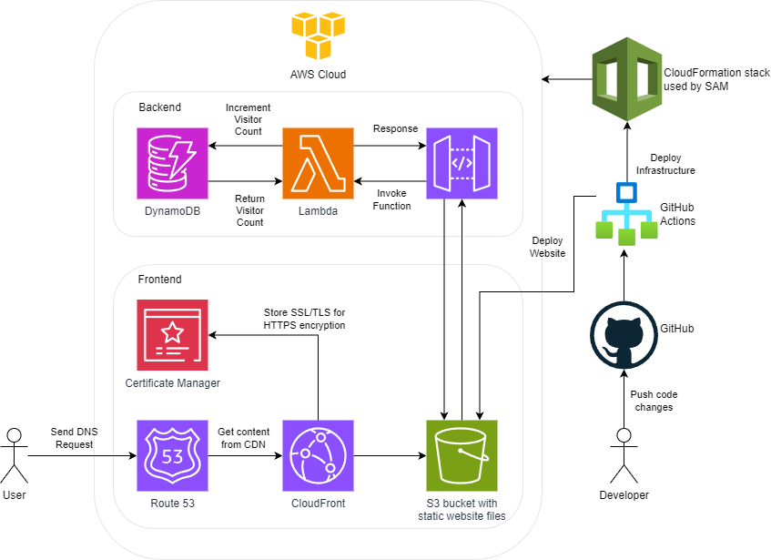
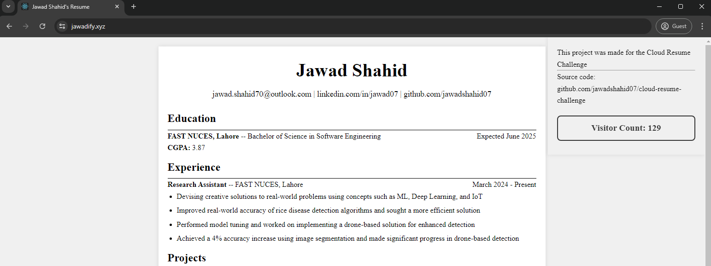
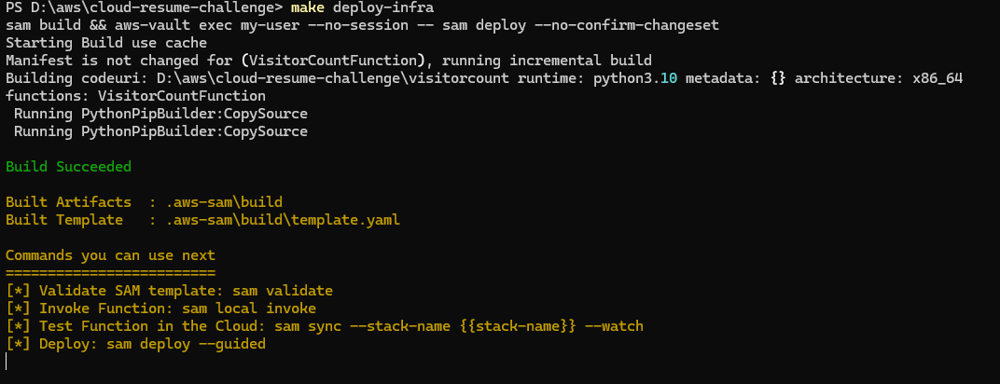
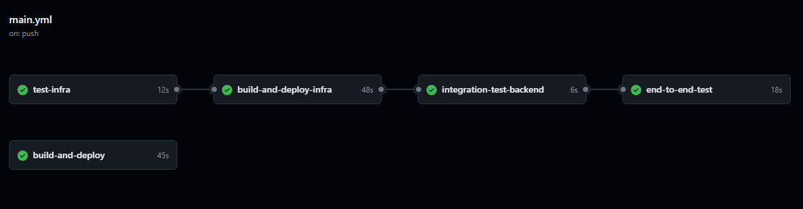
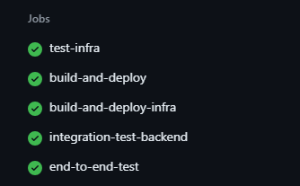

# Cloud Resume Challenge

This project is my implementation of the Cloud Resume Challenge. It showcases my skills in cloud computing, front-end development, back-end integration, and CI/CD automation. The project is built using the AWS Serverless Application Model (SAM) CLI, React, and various AWS services.

## Architecture



## Project Overview

This project includes the following components:

1. **Frontend**: A React application that displays my resume.
2. **Backend**: A serverless API built using AWS Lambda and API Gateway to store and retrieve visitor counts from a DynamoDB table.
3. **Infrastructure as Code (IaC)**: All resources are defined using AWS SAM and deployed through the SAM CLI.
4. **CI/CD**: GitHub Actions workflows for continuous integration and continuous deployment, including unit, integration, and end-to-end tests.

You can access my resume website here: [jawadify.xyz](https://jawadify.xyz).

## Project Structure

- **resume-website**: React project for the resume website.
- **visitorcount**: Code for the Lambda functions handling the API logic.
- **template.yaml**: AWS SAM template defining the resources for the project.
- **tests**: Unit, integration, and end-to-end tests for the application.
- **Makefile**: Makefile to ease deployment and testing tasks.

## Services Used

This project utilizes the following AWS services:

- **AWS CloudFormation**: Used for deploying and managing the entire infrastructure as code.
- **Amazon S3**: Hosts the static website files.
- **Amazon CloudFront**: Distributes the website content with low latency and high transfer speeds.
- **AWS Lambda**: Handles the backend logic for incrementing the visitor count.
- **Amazon API Gateway**: Provides the API interface for the Lambda function.
- **AWS Certificate Manager**: Manages SSL/TLS certificates for secure HTTPS connections.
- **Amazon DynamoDB**: Stores the visitor count data.
- **Amazon Route 53**: Manages the DNS and provides a custom domain for the website.

## Prerequisites

To run this project, you need the following tools:

- [SAM CLI](https://docs.aws.amazon.com/serverless-application-model/latest/developerguide/serverless-sam-cli-install.html)
- [Node.js](https://nodejs.org/en/download/)
- [Python 3](https://www.python.org/downloads/)
- [Docker](https://hub.docker.com/search/?type=edition&offering=community)
- [AWS CLI](https://aws.amazon.com/cli/)
- [aws-vault](https://github.com/99designs/aws-vault) (for securely managing AWS credentials)

## Deployment Instructions

### Using Makefile

The project includes a `Makefile` to simplify the build, deployment, and testing processes.

1. **Build the project:**
   ```bash
   make build
   ```
2. **Deploy the infrastructure:**
   ```bash
   make deploy-infra
   ```
3. **Deploy the frontend site:**
   ```bash
   make deploy-site
   ```
4. **Delete the infrastructure:**
   ```bash
   make delete-infra
   ```

## GitHub Actions CI/CD

The project includes a GitHub Actions workflow for CI/CD automation. The workflow performs the following steps:

1. Linting and testing the front-end code.
2. Building and deploying the SAM application.
3. Running unit, integration, and end-to-end tests.

To set up the CI/CD pipeline, ensure you have the following secrets configured in your GitHub repository:

- 'AWS_ACCESS_KEY_ID'
- AWS_SECRET_ACCESS_KEY_ID'

## Testing

### Unit Tests

Unit tests are located in the tests/unit directory. To run the unit tests, use the following command:
```bash
python -m pytest tests/test_handler -v
```

### Integration Tests

Integration tests require a deployed stack. Set the AWS_SAM_STACK_NAME environment variable to the name of your stack and run:
```bash
make integration-test
```

### End-to-End Tests

End-to-end tests are written using Puppeteer. To run the end-to-end tests, use the following command:
```bash
make e2e-test
```

## Cleanup

To delete the deployed application, use the following command:
```bash
make delete-infra
```

## Blog

Read about my journey and the challenges I faced while completing the Cloud Resume Challenge on my <a href="https://dev.to/jawadshahid07/how-to-transition-from-a-generalist-to-a-specialist-in-cloud-computing-my-journey-through-the-cloud-resume-challenge-371n">blog</a>.

## Screenshots

  
  
  
  


## Conclusion

Completing the Cloud Resume Challenge was a rewarding experience. It allowed me to dive deep into AWS services, hone my front-end and back-end development skills, and set up a robust CI/CD pipeline. This project solidified my interest in cloud computing and has set me on the path to becoming a cloud engineer.
